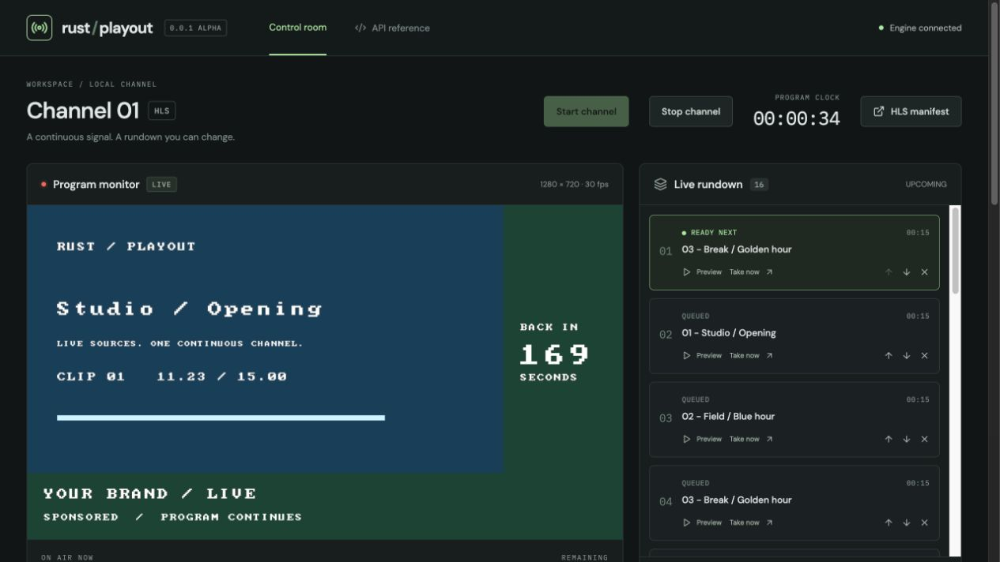
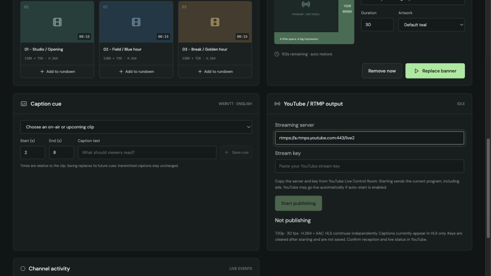

# Rust Playout

An API-controlled live playout engine with a web control room. Change upcoming
media and insert timed L-band ads while one HLS channel keeps running.

Built in Rust using **FFmpeg libraries directly**, not the `ffmpeg` executable.
See [architecture](docs/architecture.md) for scope and verification gates.

## Download 0.0.1 alpha

[**Download the macOS Apple Silicon release**](https://github.com/Thinkelution/rust-playout/releases/tag/v0.0.1-alpha)

The executable includes the web UI. Rust, Node.js and a source checkout are not
needed to run it. **Requires Homebrew FFmpeg 9 libraries**; tested on macOS 26.5.1
(arm64). Native libraries are not bundled. This alpha is not notarized.
See the [installation guide](docs/install-macos.md) for checksums, setup and limits.

## Control room preview

Actual 0.0.1-alpha UI with generated demo clips and a timed L-shaped ad:



Media, ad controls, captions and RTMP publishing:



## Development prerequisites

- Rust toolchain, Node.js 22+, pkg-config and Clang/libclang.
- FFmpeg 9 development libraries with an H.264 encoder (`libx264`) and AAC.
- macOS: `brew install rust ffmpeg pkg-config` plus Xcode command-line tools.

This is an early implementation, not a production broadcast system.

## Run the control room

```sh
cd web
npm ci
npm run build
cd ..
cargo run --release -- --demo
```

Open **http://127.0.0.1:8787**. The service starts a live standby slate. `--demo`
creates three 15-second H.264/AAC clips using the native libraries on first run.
Click **Queue all media**, change the upcoming order, and **Take banner** to put
an L-shaped ad and countdown into the actual encoded output. Clip playback and
banner expiry continue if you close the browser.

The HLS monitor is delayed by segment generation and player buffering. The
program clock and applied events report engine time. Source preview is separate.

For development, run `npm run dev` inside `web/` with the engine running. Vite
proxies `/api`, `/hls` and `/media` to the service. Use the production build above
for the same-origin control checks; the Vite proxy preserves the browser Host.

Environment: `PLAYOUT_PORT` (default `8787`), `PLAYOUT_DATA` (default `data`),
`RUST_LOG` for logging. The production web UI is embedded at build time; the binary
can run from any working directory. Build `web/dist` before compiling Rust.
Ctrl-C stops the server and drains the encoders.

## Implemented

- H.264 MP4 sources with AAC audio (video-only files get silence), up to 4K input.
- Normalized 720p30 H.264 + 48 kHz stereo AAC, continuously encoded to HLS.
- Independent RTMP/RTMPS publishing with start/stop controls and status.
- Upload media, insert after a particular item, reorder, remove and take next.
- Bounded independent decoder workers and prepared-next source.
- Timed PNG/JPEG or text/color L-band, countdown, replace/remove and auto restore.
- Clip-relative caption cues published as segmented WebVTT with transport timing.
- HTTP command acknowledgments, correlated take events and WebSocket snapshots.
- Media metadata persists; each engine restart creates a fresh channel session.

API details and examples: [control API](docs/api.md).

## Verification

```sh
cargo test --release
cargo clippy --all-targets -- -D warnings
cargo build --release && python3 tests/api_smoke.py
cd web && npm ci && npm run build
```

The integration test generates real MP4 sources, starts the engine, changes the
live rundown, takes a new source and inserts a timed banner. It then decodes the
HLS output through libavformat/libavcodec and checks video timestamp continuity,
banner/restoration pixels, non-silent source audio and caption transport mapping.
It does not require an FFmpeg executable, browser, or network service.

## Current boundaries

One channel, local MP4 inputs, one fixed output profile and hard cuts. CPU
composition, one active L-band (80% program scale, bottom/right artwork), one
English subtitle rendition. Banner text/countdown uses an ASCII bitmap font.
The service starts on localhost without accounts; remote hosting needs a proper
authentication layer. Upload limit: 250 MB per file. Artwork limit: 4096×4096.

Rundown and captions are session state and are not restored after restart.
Finished HLS sessions remain under `data/hls/`; retention across restarts is not
automated. A filesystem/output failure marks the channel failed; automatic output
recovery, network/live inputs, crossfades, GPU acceleration, broadcast
caption formats, multi-user edit conflicts and extended soak testing are future
milestones. Sustained overload is reported, not guaranteed to meet real-time.

This project links third-party native libraries. Packaging/distribution must
account for the licenses of the actual FFmpeg build and enabled encoders.

## Publish to YouTube

In the web control room, use **YouTube / RTMP output**. Copy the streaming server
URL and stream key from YouTube Live Control Room, then click **Start publishing**.
Prefer the RTMPS server on port 443 ([YouTube requirements](https://developers.google.com/youtube/v3/live/guides/rtmps-ingestion)).
The default server is editable; use the one assigned to your stream.
Check preview/stream health in YouTube and use its Go Live control if required.
If YouTube auto-start is enabled, starting the publisher can make the broadcast live.

The current program, audio, source changes and composed L-ads are sent through the
native libraries; no FFmpeg process is launched. Profile: 1280×720 at 30 fps,
H.264 target 2.5 Mbps, two-second keyframes, AAC stereo 48 kHz at 128 kbps.
This is the existing channel profile, not a configurable YouTube quality preset.
WebVTT captions remain HLS-only. Stop publishing leaves HLS and playout running.
A failed connection requires a manual restart and re-entering the key.

Keys are not saved to disk or included in state/events. The password field clears
on an accepted start. Native library logging is disabled because protocol errors
can include credential-bearing URLs; sanitized publisher errors remain visible.
The local control API remains unauthenticated and must not be exposed publicly.

Verification includes a native loopback RTMP receiver decoding audio/video with
monotonic timestamps, restart/failure isolation, and an HTTP test cancelling a
stalled RTMP handshake while the channel keeps advancing. A real YouTube broadcast
and successful RTMPS ingestion have not yet been tested.

## Channel start and stop

Use **Stop channel** to end the current clip, remove the active banner and close
HLS and RTMP publishing. Upcoming rundown items and the media library are retained.
The program clock stops and the control service stays available. Existing viewers
may finish buffered HLS media. There is no pause/resume behavior.

Use **Start channel** to create a new HLS session and reset the clock. Playback
begins with the next queued clip, or a slate when the rundown is empty. Publishing
must be started separately with the stream key. The app still starts its initial
channel automatically on launch.

API: `POST /api/channel/stop` and `POST /api/channel/start`. Stop acknowledges the
request; watch `state.status` transition through `stopping` to `stopped`. Start
while stopping is rejected. Repeating start on a live channel or stop on a stopped
channel is harmless. Take, ad insertion and publishing require a live channel.

## Build a release archive

On an Apple Silicon Mac with the development prerequisites installed, run
`./scripts/package-release.sh`. It builds the frontend, embeds it in the native
executable, applies a local ad-hoc signature, collects dependency notices and
writes the `.tar.gz` plus `SHA256SUMS` under `target/packages/`.
